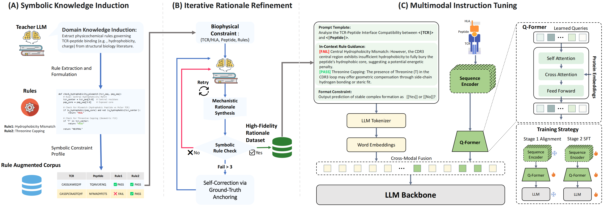

# ImmuneLLM: A Unified Multimodal Framework with Knowledge Fusion for T-cell Antigen Binding Specificity to HLA and TCR Molecules

Accurate in silico prediction of T-cell antigen binding specificity is a key challenge in computational biology, critical for vaccine design and cancer immunotherapy. Existing discriminative methods achieve strong performance by learning sequence patterns but often lack explicit domain knowledge and biophysical explainability. Furthermore, bridging the representational divide to harness generative reasoning for biologically grounded rationale generation remains an unresolved cross-modal problem. To address these gaps, we propose ImmuneLLM, a neuro-symbolic information fusion framework that unifies peptide--HLA and peptide--TCR binding prediction into a knowledge-enhanced generative task. Connecting a pre-trained protein encoder with a Large Language Model via a learnable information bottleneck, the framework filters non-interacting sequence noise and aligns dense physicochemical embeddings with linguistic semantics. To reconcile data-driven statistical correlations with rigid biophysical constraints, we introduce a knowledge fusion pipeline integrating Symbolic Knowledge Induction and Iterative Rationale Refinement. This mechanism dynamically adjudicates conflicts between deterministic rules and latent sequence features, accommodating biological exceptions. Extensive evaluations show that ImmuneLLM achieves robust predictive performance and high data efficiency across multiple datasets. More importantly, it transcends opaque probabilistic scoring to synthesize biologically grounded rationales. Independent validation experiments corroborate the biophysical fidelity of these reasoning chains, providing empirical assurance of their consistency with real-world molecular mechanisms. 


---

## 🌟 Key Features
- **Phase A: Symbolic Knowledge Induction**: Explicit biophysical rule integration.
- **Phase B: Iterative Rationale Refinement**: Logic-aligned reasoning chain generation.
- **Mechanistic Interpretability**: Audit trails for biophysical decision-making.

---

## 🚀 Navigation

To facilitate the review process, we have organized the repository as follows:

- **[📊 Datasets are in the folder ./data](./data)**: Access the UnifyImmun benchmark, induced biophysical rules, and pre-processed QA pairs.
- **[⚖️ Baselines are in the folder ./baselines](./baselines)**: Detailed implementation and 5-fold bootstrap evaluation scripts for SOTA baselines (T-SCAPE, TEIM, DeepAntigen, etc.).
- **[🔬 Case Study are in the folder ./case_studies](./case_studies)**: 5 detailed reasoning instances probing the model's biophysical decision-making.


---
### 1.Step-by-Step Environment Setup

```bash
# create environment
conda create -n immunellm python=3.10 -y
conda activate immunellm

# CUDA 11.8
pip install pyarrow==17.0.0 -i https://pypi.tuna.tsinghua.edu.cn/simple

pip install torch==2.6.0 torchvision==0.21.0 torchaudio==2.6.0 --index-url https://download.pytorch.org/whl/cu118 -i https://pypi.tuna.tsinghua.edu.cn/simple

pip install pandas==2.0.3 -i https://pypi.tuna.tsinghua.edu.cn/simple

pip install numpy==1.24.1 -i https://pypi.tuna.tsinghua.edu.cn/simple

pip install transformers==4.57.3 -i https://pypi.tuna.tsinghua.edu.cn/simple

pip install fair-esm==2.0.0 -i https://pypi.tuna.tsinghua.edu.cn/simple

pip install datasets==2.19.1 -i https://pypi.tuna.tsinghua.edu.cn/simple

pip install accelerate==1.12.0 peft==0.18.0  -i https://pypi.tuna.tsinghua.edu.cn/simple

pip install scikit-learn -i https://pypi.tuna.tsinghua.edu.cn/simple
```
---
### 2. External Dependencies & Backbones
Please download the following foundation models and pre-training datasets from HuggingFace:


- LLM Backbone: Qwen3-4B-Instruct-2507 (https://huggingface.co/Qwen/Qwen3-4B-Instruct-2507)
- Protein Encoder: ESM2-3B (t36_3B_UR50D) (https://huggingface.co/facebook/esm2_t36_3B_UR50D)
- Pretraining Dataset: UniProtQA Dataset (https://huggingface.co/datasets/PharMolix/UniProtQA)

### 3. Processed Data Preparation
Download our reasoning-enhanced datasets and checkpoints:

Download Link: ImmuneLLM Processed Data ([Baidu Netdisk](https://pan.baidu.com/s/1f6OSt_Dh2WCrUtqx62mkpQ?pwd=8sws))

Extraction Code: 8sws

### 4. Training Pipeline

## 4.1 Pre-training
Before running the pre-training script, you must update the local paths in Pretrain.py (or pass them as arguments) to match your local environment.

⚠️ Configuration Note: Open Pretrain.py and modify the following path variables to point to your downloaded models and datasets:


```
# scripts/pretrain.py
LLM_LOCAL_PATH = "path/to/your/Qwen3-4B-Instruct-2507"
ESM2_LOCAL_PATH = "path/to/your/esm2_t36_3B_UR50D"
DATASET_PATH = "path/to/your/uniprot_dataset"
OUTPUT_DIR = "./output/pretrain_v1"
```

Then, execute the pre-training:
```
python  Pretrain.py
```

## 4.2 SFT
This phase uses torchrun for multi-GPU distributed training.
Distributed training on 8 GPUs
```
torchrun --nproc_per_node=8 SFT.py \
    --esm_strategy lora \
    --qwen_strategy lora \
    --batch_size 128 \
    --grad_accum 1 \
    --epochs 2
```

### 5. Inference & Evaluation

After completing the SFT, use the following command to generate predictions and calculate evaluation metrics (AUC, PR-AUC, F1). We use torchrun to accelerate inference across multiple GPUs.
```
Distributed inference on 8 GPUs
torchrun --nproc_per_node=8 infer.py \
    --esm_strategy lora \
    --qwen_strategy lora \
    --checkpoint_path ./output/sft_v1/pytorch_model.bin
```

Run case study:

```
python case_study.py
```
